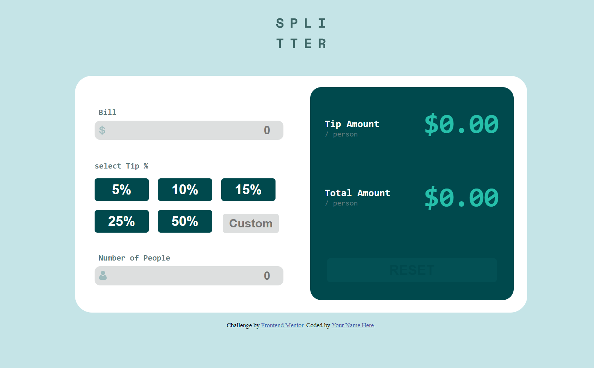
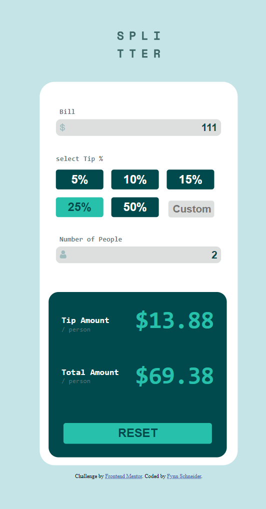

## Welcome! 👋

Thanks for checking out this front-end coding challenge.

## The challenge

Users should be able to:

- View the optimal layout for the app depending on their device's screen size
- See hover states for all interactive elements on the page
- Calculate the correct tip and total cost of the bill per person

**ScreenShot of my project/design**

**1) Home Page where a user can enter a bill, the percentage they want to tip and the amount of persons. The page will calculate how much each person has to pay**

**2) This one is the Mobile version design**

**Preview Site**

https://fynnschneider05.github.io/TipCalculator/

**Have fun building!** 🚀